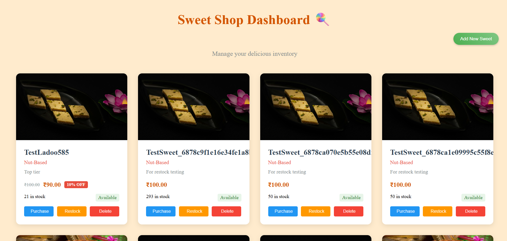
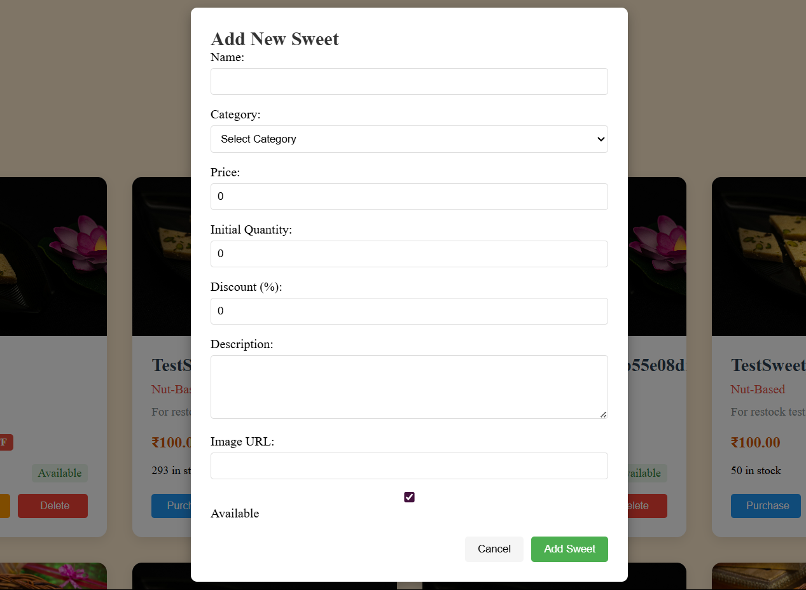
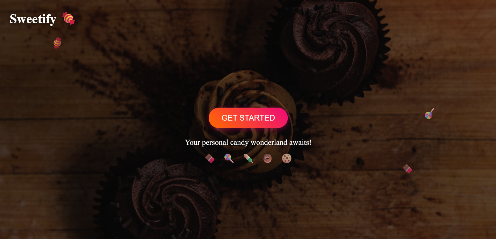
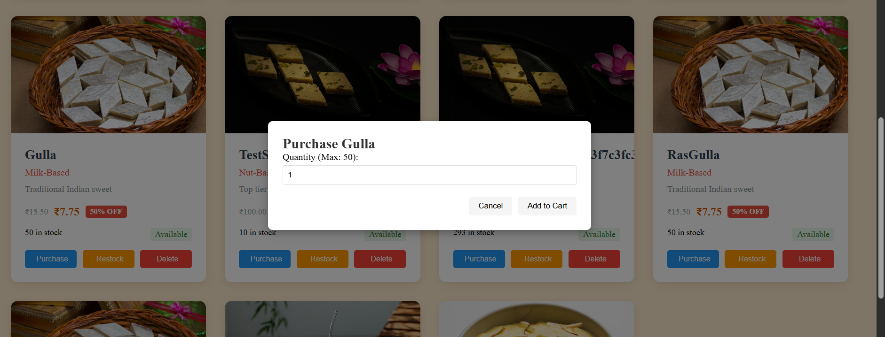
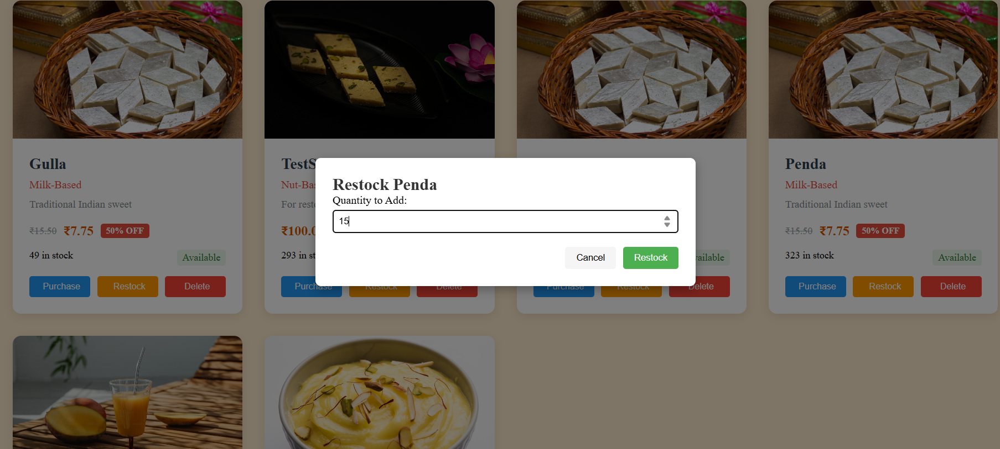
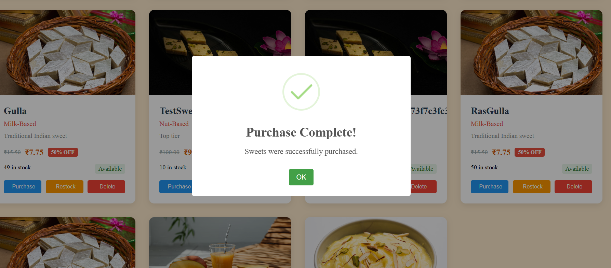

# 🍬 Kata Sweet Shop Management System

## ⚠️ PLEASE WAIT ⏳
### 💤 The API is hosted on Render and may take up to **50 seconds** to wake up after inactivity. Please be patient while waiting for responses.

---
# 🍬 Kata Sweet Shop Management System (Angular + FastAPI)

## ⚠️ PLEASE WAIT ⏳
### 💤 The API is hosted on Render and may take up to **50 seconds** to wake up after inactivity. Please be patient while waiting for responses.

---

## 📦 Project Overview

A full-stack **Sweet Shop Inventory Management System** to:

- 🔍 Search and view available sweets
- ➕ Add new sweets with name, type, quantity, and price
- 📦 Track inventory with sorting, filtering, and low-stock alerts
- 🔁 Restock sweets
- 📩 Email alerts on low stock (background tasks)
- 🎨 Clean and responsive UI using Angular with an **Orange & White** theme

---

## 🚀 Live Demo

- 🖥️ **Frontend (Angular)**: [https://kata-sweet-shop-management-system-r.vercel.app](https://kata-sweet-shop-management-system-r.vercel.app)
- 🧠 **Backend (FastAPI on Render)**: [https://kata-sweet-shop-management-system.onrender.com](https://kata-sweet-shop-management-system.onrender.com)

---

## 🛠 Tech Stack

| Frontend   | Backend          | Database | Styling    |
| ---------- | ---------------- | -------- | ---------- |
| Angular 14 | FastAPI (Python) | MongoDB  | SCSS / CSS |

---

## 📁 Features

### ✅ Core Functionalities

- 🧁 **Add Sweet**: Add sweets with name, type, quantity, and price
- 📃 **Inventory Table**: View sweets with sorting and pagination
- 🔍 **Search & Filter**: Filter sweets by name or type
- ⚠️ **Low Stock Highlight**: Auto-highlight items below stock threshold
- 🔄 **Restock Feature**: Increase quantity of existing sweets
- 📩 **Email Notification System**: Auto email alerts on low stock via background task
- 🌐 **API Integration**: Full integration with FastAPI backend

---

## 🧪 Testing

- ✅ **Frontend**: Manually tested with reactive forms and UI flow
- ✅ **Backend**: Tested with **Pytest** and **HTTPX** for async APIs

---

# 🍬 Kata Sweet Shop Management System

## 🧁 Dashboard


## ➕ Add Sweet


## 🗑️ Delete Sweet


## 🏠 Home Page


## 📦 Purchase Screen


## 🔁 Restock Screen


## ✅ Success Alert



## ⚙️ Environment Variables

```env
# Angular (environment.ts or environment.prod.ts)
API_URL=https://kata-sweet-shop-management-system.onrender.com

## 📦 Project Overview

This is a full-stack **Sweet Shop Inventory Management System** that allows you to:

- 🔍 Search & view all available sweets
- ➕ Add new sweets with name, type, quantity, and price
- 📦 Track inventory with sorting, filtering, and low-stock alerts
- 🔁 Restock sweets (Optional)
- 📩 Email notifications on low stock (backend functionality)
- 🎨 Clean and responsive UI using Tailwind CSS with **Orange & White** theme

---

## 🚀 Live Demo

- 🖥️ **Frontend (Next.js)**: [https://kata-sweet-shop-management.vercel.app](https://kata-sweet-shop-management.vercel.app)
- 🧠 **Backend (FastAPI on Render)**: [https://kata-sweet-shop-management-system.onrender.com/](https://kata-sweet-shop-management-system.onrender.com/)

---

## 🛠 Tech Stack

| Frontend        | Backend          | Database | Styling      |
| --------------- | ---------------- | -------- | ------------ |
| Next.js (React) | FastAPI (Python) | MongoDB  | Tailwind CSS |

---

## 📁 Features

### ✅ Main Functionalities

- 🧁 **Add Sweet**: Add new sweet items via a form
- 📃 **Inventory Table**: View all sweets with sorting
- 🔎 **Search & Filter**: Filter sweets by name or type
- 📉 **Low Stock Alerts**: Highlight items below threshold
- 🌐 **API Integration**: Realtime calls with async handling
- 🌒 **Production-Ready Deployment**: Vercel + Render combo

---

## 🧪 Testing

- Frontend tested with manual UI + form inputs
- Backend tested with Pytest and HTTPX for async endpoints

---

## ⚙️ Environment Variables

```env
NEXT_PUBLIC_API_URL=https://kata-sweet-shop-api.onrender.com
